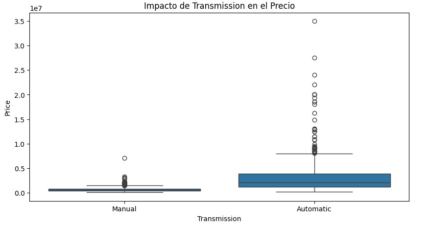
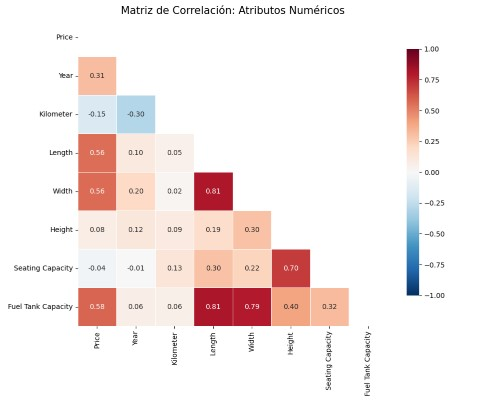
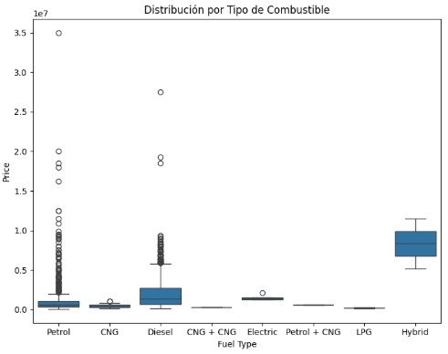
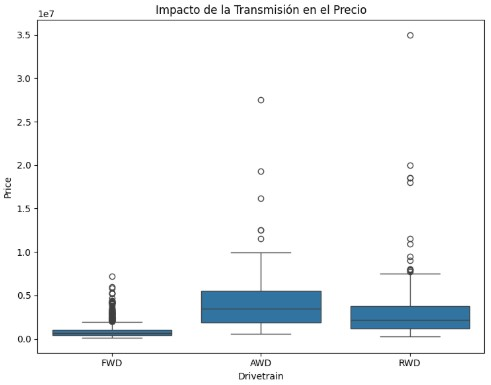

# Car Price Prediction Pipeline - Reporte

## Definición del problema y métrica
Objetivo: Predecir el precio de venta de vehículos usados. Los valores de los mismos están en Rupias (INR)

Métrica: Por su sensibilidad frente a valores atípicos se eligió Root Mean Squared Error (RMSE) como métrica para los errores.

## Creación del conjunto de prueba:
Para esto se realizó un Muestreo Estratificado (Stratified Sampling), de esta manera se evitó que una variable categórica importante quede mal representada a causa del azar propio de un muestreo aleatorio. A través generar boxplots se concluyó que la variable categórica con mayor correlación con respecto al precio es "Transmission" (ver fig 1). Hay mucha varianza entre los dos "boxes" y poco solapamiento, además la distancia intercuartil de automatic es notablemente mayor que la de manual. 

A pesar de que las demás variables categóricas también presentaban varianza entre sus categorías, tenían la desventaja de que algunas de ellas tenían muy pocos elementos o estaban casi todos en una misma categoría, es el caso de por ejemplo Seller Type (Individual tenía 1997 elementos, Corporate tenía 57 elementos, Commercial Registration tenía 5 elementos), problemas como este pueden generar overfitting.

## Correlaciones

### Correlación en variables numéricas
Para ver esta correlación se recurrió a la matriz de correlaciones. La misma arrojó lo siguientes resultados:

Los mismos indícan que las variables "Fuel Tank Capacity", "Width", "Length" e "Year" tienen la mayor capacidad predictora.

### Correlación en variables categóricas
Ya se vió que la variable categórica con mayor poder predictivo es "Transmission", pero a través de boxplots se vió que hay otras variables importantes también, estas son "Fuel Type", "Drivetrain", "Make", "Color". Se priorizaron estas variables para el entrenamiento, descartando aquellas con distribuciones muy sesgadas o baja varianza (como "color") para evitar el sobreajuste del modelo. A continuación presento los boxplots de las variables "Fuel Type" y "Drivetrain" (Make tiene muchas categorias dentro y es incomodo de graficar):

## Preparación de datos (Data Engineering)

### Manejo de Strings
En la clase StringNumericExtractor se definió la función transform. La mísma transforma las variables de tipo sting"Engine", "Max Power" y "Max Torque" en variables de tipo float luego de quitar las unidades de medida correspondientes de cada variable y extraer los números.

### Creación de variables (Feature Engineering)
En la clase CombinedAttributesAdder se definió la función transform que crea los atributos categóricos seat_cat, tank_cat y age_cat a partir de los atributos numéricos seating_capacity, Fuel Tank Capacity e Year respectivamente. Esto se hizo porque estos datos tienen mejor capacidad explicativa como variables categoricas antes que numéricas. 

#### Seating Capacity
Este atributo es una categoría por sí misma, entonces la creación de seat_cat fue copiar los datos de en la columna Seating Capacity en la columna seat_cat

#### Fuel Tank Capacity
Para este atributo se consideraron los cuartiles Q1, Q2 y Q3. Dado un auto, según el cuartil al que pertenece la capacidad de su tanque, se determinó si si tanque era "Chico", "Mediano", "Grande" o "Muy grande" y se guardó en resultado en la columna tank_cat.

#### Year
A partir del modelo del vehículo y asumiendo que se está en el año 2026 se calculó la edad del auto. Según su edad se determinó que el auto era "Nuevo" (entre 0 y 3 años), "Semi Nuevo" (entre 4 y 7 años), "Usado" (entre 8 y 12 años) o "Antiguo" (13 o más años).

### Estrategia de Imputación
Se definió la función build_full_pipeline. En la misma se realizaron las siguientes imputaciones (luego de la transformación anterior de datos):

#### Variables numéricas
Se rellenaron los datos vacíos con la mediana correspondiente a la categoría numérica donde falta el dato. Elegí la mediana y no la media por su robustez frente a outliers.

#### Variables categóricas
Se rellenaron los datos vacíos con la moda correspondiente a la categoría categórica donde falta el dato.

### Escalamiento de Atributos
Se integró StandardScaler en el pipeline final para normalizar las variables numéricas. Esto garantiza que atributos con magnitudes numéricas muy distintas (como el precio vs. el año del vehículo) tengan el mismo peso relativo durante el entrenamiento, evitando sesgos numéricos.

## Selección de Modelos

### Modelo 1 (Lineal)
#### Error del Modelo 1:
Error promedio (RMSE): 1,093,647

#### Conclusión Modelo 1:
Un error típico de INR 1,093,647 no es muy satisfactorio cuando la media de los precios es INR 1,702,992.

Este modelo subajusta (underfitting) los datos de entrenamiento (las características no aportan suficiente información o las relaciones no son lineales).

### Modelo 2 (Decision Tree)
#### Error del Modelo 2:
RMSE (Árbol): 31,010

Se observó que el error es muy bajo respecto al del modelo anterior. Por lo tanto se realizó cross validation.

#### Cross Validation Modelo 2:
Scores: [1396175.37625932 1195982.09516347  801600.33566958 1533101.39867863
 1517477.10146372 1031963.09990413  563945.73873957 1113224.31584031
 1533250.10714529 1203492.30616065]
Mean: 1,189,021
Standard deviation: 309,703

#### Conclusión Modelo 2:
Luego de realizar cross validation se observa que el modelo no era tan bueno como parecía al comienzo, la media indica que es incluso peor que el modelo 1. 

### Modelo 3 (Random Forest)
#### Error del Modelo 3:
RMSE (Forest): 359,811

#### Cross Validation Modelo 3:
Scores: [1009849.38026301  564337.52714349 1097776.65385314 1198758.00739904
  607592.12046677  679186.67923458  463259.55011347  512368.87601882
 1798649.2279613  1016893.82392933]
Mean: 894,867
Standard deviation: 393,616

#### Conclusión Modelo 3:
De momento el Modelo 3 con Random Forest es el modelo que predice con menor error el valor del vehículo.

### Conclusión:
Random Forest redujo el error promedio por debajo de INR 900,000, superando la barrera del millón impuesta por el modelo lineal. La siguiente etapa consistirá en la optimización de hiperparámetros para intentar reducir aún más la varianza del error.
